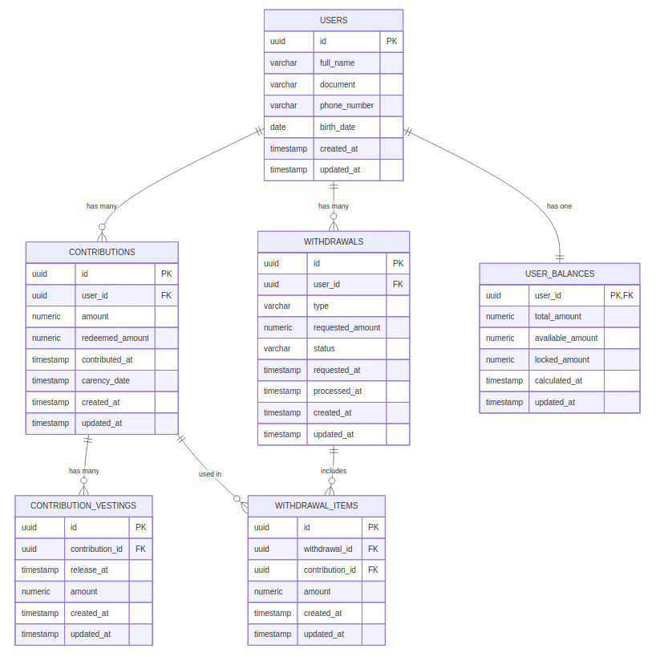

# Previdência API

API em NestJS voltada para gestão de saldos e solicitações de resgate de planos de previdência privada.

## Desafio proposto

- Permitir que um chatbot consulte o saldo total do participante e o saldo disponível para resgate.
- Atender solicitações de resgate total ou parcial, respeitando saldo disponível, regras de carência e demais restrições do produto.

## Solução desenvolvida

A solução foi construída em TypeScript utilizando o framework NestJS para expor uma API REST modular, com camadas bem definidas seguindo princípios de Clean Architecture e DDD. A aplicação é containerizada com Docker e Docker Compose, facilitando execução local e implantação. O projeto já considera observabilidade (Prometheus/Grafana) e testes automatizados, preparando o terreno para escalar horizontalmente com múltiplas réplicas da API e serviços de suporte compartilhados.

## Stack principal

- Node.js 20 + NestJS 11
- PostgreSQL 16
- Prometheus + Grafana (monitoramento)
- TypeScript, ESLint (PSR-like), Prettier
- Docker e Docker Compose para orquestração local

## Dependências (Pré-requisitos)

- Node.js 20 e npm 10 (ou superior)
- Docker 24+ e Docker Compose v2 (opcional, para ambiente containerizado)

## Arquitetura

- **Camada de domínio (`src/domain`)**: concentra regras de negócio puras e independentes de frameworks.
- **Camada de aplicação (`src/application`)**: orquestra casos de uso, serviços e eventos (CQRS).
- **Camada de infraestrutura (`src/infrastructure`)**: implementa adapters (TypeORM, persistência de resgates, monitoramento).
- **Apresentação (`src/presentation`)**: controllers REST que expõem a API.
- **Observabilidade**: métricas expostas em `/metrics` e coletadas pelo Prometheus, visualizadas no Grafana.

### Modelagem atual

- **Banco relacional**: tabelas `users`, `contributions`, `withdrawals`, `withdrawal_items`, `user_balances` e `contribution_vestings`.
- **Domínio**: entidades (`Contribution`, `WithdrawalRequest`, `User`), objetos de valor (`Money`, `CarencyDate`), serviços (`BalanceCalculatorService`, `WithdrawalValidatorService`) e exceções específicas.
- **Liberação parcial**: cada `Contribution` pode carregar curvas de vesting (`contribution_vestings`), permitindo cálculo do saldo disponível por lotes liberados ao longo do tempo.
- **Infraestrutura**: repositórios TypeORM, serviço de persistência de resgates, projeção `UserBalanceProjector`.

<p align="center">
  
</p>

## Como isso funciona?

Fluxo de alto nível:
- Controllers validam entradas e chamam os casos de uso.
- Casos de uso consultam o domínio e persistência para calcular saldos ou aprovar resgates.
- Eventos CQRS recalculam projeções de saldo após contribuições ou resgates.
- Métricas de sucesso/erro são expostas em `/metrics` para monitoramento.

## Detalhes das implementações

### Fluxos

- **Consulta de saldo**
  1. `GET /users/:userId/balance`
  2. Validação e delegação ao `GetBalanceUseCase`
  3. Busca projeção materializada ou calcula dinamicamente
  4. Atualiza projeção (quando necessário) e retorna totais

- **Solicitação de resgate**
  1. `POST /users/:userId/withdrawals`
  2. Validação de payload (`RequestWithdrawalUseCase`)
  3. Validação de regras de negócio (`WithdrawalValidatorService`)
  4. Persistência do resgate e disparo de eventos para atualizar projeções
  5. Resposta com valor aprovado e saldo remanescente

### Rotas disponíveis

| Método | Rota                         | Descrição                              |
| ------ | ---------------------------- | -------------------------------------- |
| GET    | `/users/:userId/balance`     | Consulta saldo total e disponível      |
| POST   | `/users/:userId/withdrawals` | Solicita resgate total ou parcial      |
| GET    | `/metrics`                   | Exposição de métricas Prometheus       |

## Executando a aplicação

### Configuração inicial

1. Instale dependências:
   ```bash
   npm install
   ```
2. Configure variáveis de ambiente em `.env` (ou diretamente no ambiente):
   ```bash
   DATABASE_HOST=localhost
   DATABASE_PORT=5432
   DATABASE_USER=previdencia
   DATABASE_PASSWORD=previdencia
   DATABASE_NAME=previdencia
   ```

### Execução local

- Desenvolvimento com reload:
  ```bash
  npm run start:dev
  ```
- Produção (build + execução):
  ```bash
  npm run build
  npm run start:prod
  ```

### Ambiente Docker

1. Construa as imagens:
   ```bash
   docker compose build
   ```
2. Copie `env.sample` para `.env` e ajuste as credenciais antes de subir:
   ```bash
   cp env.sample .env
   ```
3. Suba os serviços (API, PostgreSQL e monitoramento):
   ```bash
   docker compose up -d
   ```
4. A API ficará disponível em `http://localhost:3000`. O banco usa credenciais do `.env`.
5. Monitoramento:
   - Prometheus em `http://localhost:9090`
   - Grafana em `http://localhost:3001` (login conforme variáveis `GRAFANA_*`)
   - Métricas da API em `http://localhost:3000/metrics`

Para encerrar:
```bash
docker compose down
```

## Testes

- Testes unitários:
  ```bash
  npm run test
  ```
- Testes e2e:
  ```bash
  npm run test:e2e
  ```
- Cobertura:
  ```bash
  npm run test:cov
  ```

## Monitoramento

- Métricas Prometheus em `/metrics`, incluindo contadores de leituras de saldo e solicitações de resgate (sucesso/erro).
- Prometheus configurado no `docker-compose.yml` com scrape automático da API.
- Grafana acessível no serviço `grafana` e apontando para `http://prometheus:9090` como fonte de dados.
- Dashboard inicial sugerido: **Prometheus Stats (ID 3662)**, além de gráficos personalizados para as métricas `previdencia_balance_reads_total` e `previdencia_withdrawal_requests_total`.
